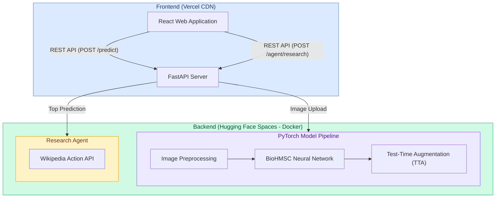

# 🌊 Sea Animal Classifier
An end-to-end cloud-native Machine Learning application that classifies 23 different marine species using a custom PyTorch neural network, featuring an autonomous AI Research Agent that dynamically fetches Wikipedia data for the identified species.

Built using **FastAPI**, **PyTorch (EfficientNetV2)**, **Hugging Face Spaces (Docker)**, and **React + Vite**.

## 🚀 Live Demo & Links

* 🌐 **Frontend (Vercel)**: [https://sea-animal-classifier.vercel.app/](https://sea-animal-classifier.vercel.app/)
* ⚙️ **Backend API (Hugging Face)**: [https://huggingface.co/spaces/harsh0o23/seaanimal-api](https://huggingface.co/spaces/harsh0o23/seaanimal-api)
* 🐙 **GitHub Repository**: [https://github.com/Harshkumar2306/Sea-Animal-Classifier](https://github.com/Harshkumar2306/Sea-Animal-Classifier)

---

## 🏗️ System Architecture



---

## 🌟 Features

### 1. High-Performance Neural Network (`BioHMSC`)
* Custom PyTorch architecture built on top of the **EfficientNetV2** backbone.
* Shared MLP layer with dual heads for multi-scale classification (Fine species vs. Coarse groups).
* Detects **23 marine species** including Octopus, Sea Turtles, Nudibranchs, Corals, and Dolphins.
* Utilizes **Test-Time Augmentation (TTA)** (Horizontal Flipping) during inference to boost confidence and accuracy.

### 2. Autonomous Research Agent
* Once the neural network classifies an animal, the backend automatically triggers an intelligent Research Agent.
* The Agent maps the model's output to exact Wikipedia taxonomy (e.g. `Turtle_Tortoise` → `Sea turtle`).
* Communicates directly with the **Wikipedia Action API** to fetch the exact summary and article URL, bypassing REST API rate limits and human disambiguation pages.

### 3. Fully Decoupled, Cloud-Native Deployment
* **Backend**: Dockerized FastAPI application deployed to a Hugging Face Space. CPU-only PyTorch optimization reduces the image size drastically.
* **Frontend**: Blazing fast React + Vite Single Page Application (SPA) deployed to the Vercel Global Edge Network.
* **CORS**: Securely configured to allow seamless cross-origin communication between Vercel and Hugging Face.

---

## 🛠️ Local Setup & Testing

### Prerequisites
* Python 3.10+
* Node.js 18+

### 1. Run the Backend API
Navigate to the backend directory, install the dependencies, and start the FastAPI server:
```bash
cd backend
pip install -r requirements.txt
uvicorn main:app --host 0.0.0.0 --port 8000 --reload
```
The API will be available at `http://localhost:8000`.

### 2. Run the React Frontend
Open a new terminal window, navigate to the frontend directory, install npm packages, and start Vite:
```bash
cd frontend
npm install
npm run dev
```
The application will be available at `http://localhost:5173`.

*Note: Create a `.env` file in the `frontend` directory with `VITE_API_URL=http://localhost:8000` for local development.*

---

## ☁️ Cloud Deployment

### Backend Deployment (Hugging Face Spaces)
1. Create a new **Docker Space** on Hugging Face.
2. Push the contents of the `backend` folder (including `Dockerfile` and `BioHMSC_best_model.pth`) to the Space.
3. Hugging Face will automatically build the Docker image and expose port `7860`.

### Frontend Deployment (Vercel)
1. Connect your GitHub repository to **Vercel**.
2. Set the Root Directory to `frontend`.
3. Add an Environment Variable: `VITE_API_URL` pointing to your live Hugging Face URL.
4. Click Deploy.

---

## 📁 Project Structure
```text
Sea-Animal-Classifier/
├── backend/
│   ├── main.py            # FastAPI entry point & API routes
│   ├── ml_model.py        # PyTorch model architecture & inference logic
│   ├── agent.py           # Wikipedia Action API research agent
│   ├── requirements.txt   # Python dependencies
│   ├── Dockerfile         # Hugging Face deployment container
│   └── BioHMSC_best_model.pth # Pre-trained PyTorch weights
├── frontend/
│   ├── src/
│   │   ├── App.jsx        # Main React UI with image upload & results
│   │   ├── index.css      # Custom UI styling
│   │   └── main.jsx       # React DOM rendering
│   ├── package.json       # Node.js dependencies
│   └── vite.config.js     # Vite configuration
└── README.md              # Project documentation
```

---

## 🧪 API Endpoints

| Method | Endpoint | Description |
|--------|----------|-------------|
| `POST` | `/predict` | Upload an image and receive the top 3 AI predictions with confidence scores. |
| `POST` | `/agent/research` | Submit a class label (e.g. `Octopus`) to fetch Wikipedia research data dynamically. |

---

> **Created and maintained by [Harshkumar2306](https://github.com/Harshkumar2306)**
