<div align="center">

# 🌊 Bio-HMSC: Sea Animal Classifier & AI Marine Biologist

[](https://sea-animal-classifier.vercel.app/)
[](https://huggingface.co/spaces/harsh0o23/seaanimal-api)
[](https://pytorch.org/)
[](https://fastapi.tiangolo.com/)
[](https://react.dev/)
[](LICENSE)

<p align="center">
  <b>A Cloud-Native Marine Species Classification System & Autonomous AI Research Agent</b><br>
  Powered by <b>Bio-HMSC++++</b> (Biological Hierarchical Multi-Scale Classifier) on <b>EfficientNetV2-M</b>, achieving <b>94.16% Test Accuracy</b> and <b>99.12% ROC-AUC</b> across 23 marine species.
</p>

[🌐 Live Web App](https://sea-animal-classifier.vercel.app/) • [⚙️ API Endpoint](https://huggingface.co/spaces/harsh0o23/seaanimal-api) • [📄 Research & Architecture](#-bio-hmsc-neural-network-architecture) • [🚀 Quickstart](#-local-installation--setup)

</div>

---

## 📑 Table of Contents
- [🌟 Key Highlights](#-key-highlights)
- [🏗️ System Architecture](#-system-architecture)
- [🧠 Bio-HMSC Neural Network Architecture](#-bio-hmsc-neural-network-architecture)
  - [Dual-Head Biological Hierarchy](#dual-head-biological-hierarchy)
  - [Taxonomy-Aware Loss Function](#taxonomy-aware-loss-function)
  - [Experimental Results & Metrics](#experimental-results--metrics)
  - [Ablation Study](#ablation-study)
  - [Model Comparison](#model-comparison)
- [🤖 Autonomous Marine Research Agent](#-autonomous-marine-research-agent)
- [🔄 24/7 Cloud Keep-Alive Engine](#-247-cloud-keep-alive-engine)
- [🧪 API Reference](#-api-reference)
- [📁 Project Structure](#-project-structure)
- [🛠️ Local Installation & Setup](#️-local-installation--setup)
- [☁️ Cloud Deployment Guide](#-cloud-deployment-guide)
- [👨‍💻 Author & Acknowledgements](#-author--acknowledgements)

---

## 🌟 Key Highlights

- **🎯 State-of-the-Art Accuracy**: **94.16% Top-1 Test Accuracy** and **99.12% ROC-AUC** across 23 marine animal classes.
- **🧬 Dual-Head Hierarchical Classification**: Predicts fine-grained marine species (23 classes) while simultaneously predicting coarse biological taxonomy (5 parent groups: *Mammals, Birds, Fish, Invertebrates, Reptiles*).
- **⚖️ Biological Penalty Matrix**: Penalizes cross-taxonomic misclassifications (e.g., classifying a fish as a mammal) more heavily than within-group errors.
- **⚡ Test-Time Augmentation (TTA) & Model EMA**: Incorporates horizontal flipping inference averaging (+2.20% boost) and Exponential Moving Average (`decay=0.9998`) for generalization.
- **🤖 Autonomous AI Research Agent**: Automatically queries the Wikipedia Action API to retrieve taxonomy, habitat summaries, and verified scientific references.
- **🌐 Fully Decoupled Cloud-Native Stack**: React 19 + Vite deployed on **Vercel Edge Network** with a containerized CPU-optimized FastAPI backend on **Hugging Face Spaces**.
- **⏱️ 24/7 Keep-Alive Automation**: Automated via **GitHub Actions Cron** to prevent free-tier cloud instances from sleeping.

---

## 🏗️ System Architecture

```mermaid
graph TB
    subgraph Client["🌐 Client Layer (Vercel CDN)"]
        UI["React 19 + Vite SPA"]
        History["Multi-Image Session Queue"]
        UI --> History
    end

    subgraph Backend["⚙️ Cloud API Layer (Hugging Face Spaces Docker)"]
        FastAPI["FastAPI REST Server (Uvicorn)"]
        KeepAlive["Keep-Alive Health Endpoint (/health)"]
        
        subgraph ML["🧠 Bio-HMSC Inference Engine"]
            Prep["Image Preprocessing (384x384, Norm)"]
            Backbone["EfficientNetV2-M Backbone (~53.5M Params)"]
            SharedMLP["Shared MLP (512-dim + SiLU + Dropout)"]
            SpeciesHead["Species Head (23 Classes)"]
            CoarseHead["Coarse Taxonomic Head (5 Groups)"]
            TTA["Test-Time Augmentation (TTA) + Temperature Scaling"]
            
            Prep --> Backbone --> SharedMLP
            SharedMLP --> SpeciesHead
            SharedMLP --> CoarseHead
            SpeciesHead --> TTA
        end

        subgraph Agent["🤖 Autonomous Research Agent"]
            TaxonomyMap["Species-to-Taxa Semantic Mapper"]
            WikiAPI["Wikipedia Action API Engine"]
            Fallback["Smart Multi-Tier Fallback Resolver"]
            
            TaxonomyMap --> WikiAPI --> Fallback
        end

        FastAPI --> ML
        FastAPI --> Agent
    end

    subgraph Automation["🔄 24/7 Uptime Engine"]
        GHA["GitHub Actions Cron (Every 30m)"]
        PyScript["keep_alive.py Daemon"]
        GHA -->|HTTP GET /| FastAPI
        PyScript -->|HTTP GET /| FastAPI
    end

    UI -->|"POST /predict (Image multipart/form-data)"| FastAPI
    UI -->|"POST /agent/research (Class label JSON)"| FastAPI

    style Client fill:#eff6ff,stroke:#3b82f6,stroke-width:2px,color:#1e3a8a
    style Backend fill:#f0fdf4,stroke:#22c55e,stroke-width:2px,color:#14532d
    style ML fill:#faf5ff,stroke:#a855f7,stroke-width:2px,color:#581c87
    style Agent fill:#fffbeb,stroke:#f59e0b,stroke-width:2px,color:#78350f
    style Automation fill:#fdf2f8,stroke:#ec4899,stroke-width:2px,color:#831843
```



---

## 🧠 Bio-HMSC Neural Network Architecture

The application is powered by **Bio-HMSC++++** (*Biological Hierarchical Multi-Scale Classifier*), a customized deep neural network designed for high-resolution underwater marine imagery.

### Dual-Head Biological Hierarchy

Standard classifiers treat all error types equally. Bio-HMSC structures marine life into a biological hierarchy:

```
Marine Organisms (Input: 384x384 RGB)
│
├── 🐋 Mammal          ─── Dolphin, Otter, Seal, Whale
├── 🐧 Bird            ─── Penguin
├── 🦈 Fish            ─── Eel, Fish, Puffers, Sea Rays, Seahorse, Sharks
├── 🐙 Invertebrate    ─── Clams, Corals, Crabs, Jelly Fish, Lobster, Nudibranchs, Octopus, Sea Urchins, Shrimp, Squid, Starfish
└── 🐢 Reptile         ─── Turtle / Tortoise
```

### Taxonomy-Aware Loss Function

To enforce hierarchical consistency, Bio-HMSC employs a custom loss formulation combining label-smoothed Cross-Entropy with a **Biological Penalty Matrix** $\mathbf{M}$:

$$\mathcal{L}_{\text{total}} = \mathcal{L}_{\text{CE}}(\hat{y}_{\text{species}}, y_{\text{fine}}) + \mathcal{L}_{\text{CE}}(\hat{y}_{\text{coarse}}, y_{\text{coarse}}) + \lambda \sum_{k} p_k \mathbf{M}_{y_{\text{fine}}, k}$$

Where:
- $\mathbf{M}_{i, j} = 0.5$ if species $i$ and $j$ share the same coarse biological group.
- $\mathbf{M}_{i, j} = 1.5$ if species $i$ and $j$ belong to different coarse biological phyla.
- $\lambda = 0.3$ serves as the penalty weighting coefficient.

---

### Experimental Results & Metrics

Evaluated on **2,038 strictly unseen real-world test images** (split with grouping to prevent data leakage):

| Metric | Score | Description |
|:---|:---:|:---|
| **Top-1 Test Accuracy** | **94.16%** | Overall fine-grained classification accuracy |
| **ROC-AUC (OvR)** | **99.12%** | Area under the Multi-Class ROC curve |
| **Top-3 Accuracy** | **97.64%** | Ground truth within top 3 predicted labels |
| **Top-5 Accuracy** | **98.38%** | Ground truth within top 5 predicted labels |
| **Weighted F1-Score** | **0.9417** | Balanced harmonic mean of precision & recall |
| **Macro F1-Score** | **0.9350** | Unweighted mean F1 across all 23 classes |
| **Coarse Phylum Accuracy** | **96.81%** | Accuracy on parent biological taxonomy |
| **Model Parameters** | **~53.5 M** | Backbone (`tf_efficientnetv2_m`) + Heads |

---

### Ablation Study

| Model Configuration | Test Accuracy | $\Delta$ Improvement | Key Contribution |
|:---|:---:|:---:|:---|
| Baseline (EfficientNetV2-M + Standard CE) | 87.41% | — | Baseline feature extraction |
| + Taxonomy-Aware Loss & Dual-Head | 89.25% | **+1.84%** | Biological separation & structured representations |
| + Model Exponential Moving Average (`ModelEmaV2`) | 91.50% | **+2.25%** | Prevents late-epoch weight oscillation |
| + Test-Time Augmentation (TTA: Flip Inference) | **93.70%** (Final: 94.16%) | **+2.20%** | Rotational & orientation invariance |

---

### Model Comparison

| Architecture | Parameters | Test Accuracy | Inference Latency (CPU) | Suitability |
|:---|:---:|:---:|:---:|:---|
| MobileNetV2 | ~3.5 M | 85.30% | ~45ms | Lightweight, but underfits on complex marine textures |
| ResNet-50 | ~25.6 M | 88.65% | ~95ms | Struggles with fine multi-scale underwater patterns |
| **Bio-HMSC (Proposed)** | **~53.5 M** | **94.16%** | **~120ms** | **Optimal balance of multi-scale depth & hierarchical accuracy** |

---

## 🤖 Autonomous Marine Research Agent

Once a classification is produced, the system automatically initiates an **AI Research Agent** (`agent.py`) to provide scientific context:

1. **Semantic Taxonomy Normalization**: Translates raw labels (`Turtle_Tortoise` $\rightarrow$ `Sea turtle`, `Sea Rays` $\rightarrow$ `Batoidea`).
2. **Wikipedia Action API Integration**: Queries direct raw extracts bypassing disambiguation barriers and bot rate limits.
3. **Multi-Tier Fallback Mechanism**:
   - Tier 1: Exact biological article lookup.
   - Tier 2: Singular morphological transformation (strips plurals).
   - Tier 3: Contextual search (`"{label} marine animal"`) extracting the top entity summary.

---

## 🔄 24/7 Cloud Keep-Alive Engine

To prevent free-tier Hugging Face Spaces from idling after inactivity, this repository includes a dual keep-alive mechanism:

### 1. Automated GitHub Actions Workflow
The workflow `.github/workflows/keep_alive.yml` runs a lightweight cron schedule every 30 minutes on GitHub's infrastructure:
```yaml
on:
  schedule:
    - cron: '*/30 * * * *'
```

### 2. Standalone Python Daemon (`keep_alive.py`)
Run locally or on any server to continuously ping the health endpoint every 10 minutes:
```bash
python keep_alive.py
```

---

## 🧪 API Reference

Base URL: `https://harsh0o23-seaanimal-api.hf.space` (or `http://localhost:8000`)

### 1. Health Check
```http
GET /health
```
```json
{
  "status": "healthy"
}
```

### 2. Classify Marine Species
```http
POST /predict
Content-Type: multipart/form-data
```
**Request**: Form data with image file under `file` key.

**Response**:
```json
{
  "predictions": [
    { "label": "Octopus", "conf": 98.42 },
    { "label": "Squid", "conf": 1.25 },
    { "label": "Nudibranchs", "conf": 0.33 }
  ]
}
```

### 3. Fetch Research Agent Data
```http
POST /agent/research
Content-Type: application/json
```
**Request**:
```json
{
  "label": "Octopus"
}
```
**Response**:
```json
{
  "title": "Octopus",
  "summary": "Octopuses are soft-bodied, eight-limbed molluscs of the order Octopoda...",
  "url": "https://en.wikipedia.org/wiki/Octopus"
}
```

---

## 📁 Project Structure

```text
Sea-Animal-Classifier/
├── .github/
│   └── workflows/
│       └── keep_alive.yml      # 24/7 GitHub Actions keep-alive automation
├── backend/
│   ├── main.py                 # FastAPI application & route controllers
│   ├── ml_model.py             # Bio-HMSC architecture & PyTorch inference pipeline
│   ├── agent.py                # Autonomous Wikipedia research agent
│   ├── requirements.txt        # Python backend dependencies
│   ├── Dockerfile              # CPU-optimized Docker container for Hugging Face
│   └── BioHMSC_best_model.pth  # Pre-trained neural network weights (~200MB)
├── frontend/
│   ├── src/
│   │   ├── App.jsx             # Interactive UI, Drag & Drop, History Dashboard
│   │   ├── App.css             # Component-level styling
│   │   ├── index.css           # Global modern responsive CSS theme
│   │   └── main.jsx            # React root mount
│   ├── package.json            # Node.js dependencies
│   └── vite.config.js          # Vite build config
├── keep_alive.py               # Local/daemon keep-alive ping script
└── README.md                   # Project documentation & benchmark report
```

---

## 🛠️ Local Installation & Setup

### Prerequisites
- **Python 3.10+**
- **Node.js 18+** & **npm**

### 1. Start Backend Server
```bash
cd backend
pip install -r requirements.txt
uvicorn main:app --host 0.0.0.0 --port 8000 --reload
```
API Documentation will be live at: `http://localhost:8000/docs`

### 2. Start Frontend Client
```bash
cd frontend
npm install
npm run dev
```
Frontend Web App will open at: `http://localhost:5173`

*(Optional: Create `.env` in `frontend/` with `VITE_API_URL=http://localhost:8000`)*

---

## ☁️ Cloud Deployment Guide

### Deploy Backend (Hugging Face Spaces)
1. Create a new **Docker Space** on [Hugging Face](https://huggingface.co/new-space).
2. Set Space SDK to **Docker**.
3. Push the `backend/` contents (including `Dockerfile` and `BioHMSC_best_model.pth`).
4. Hugging Face automatically builds the container and exposes port `7860`.

### Deploy Frontend (Vercel)
1. Import the repository into [Vercel](https://vercel.com/new).
2. Set **Root Directory** to `frontend`.
3. Add Environment Variable:
   - `VITE_API_URL` = `https://<your-space-name>.hf.space`
4. Click **Deploy**.

---

## 👨‍💻 Author & Acknowledgements

- **Developed by**: [Harsh Kumar](https://github.com/Harshkumar2306)
- **Model Backbone**: `timm` (PyTorch Image Models by Ross Wightman)
- **Dataset**: Marine Species Image Dataset (Flickr curated & partitioned)

<div align="center">
  <sub>Built with ❤️ for marine biology, deep learning research, and cloud computing.</sub>
</div>
